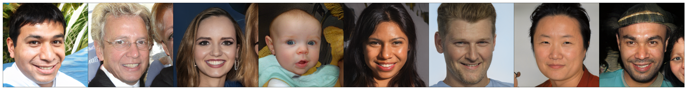
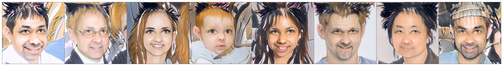

# GAN_domain_adaptation
CLIP-Guided Domain Adaptation of Image Generators

In this part of the assignment, we implemented one of the StyleGAN-2 text-based editing concepts from the StyleCLIP-NADA paper.

We utilized this concept for domain adaptation in GAN generation. As a result, our model is capable of transforming facial photographs into anime-style images featuring cat ears, achieving medium-quality results.

# Launch instructions
The development relied exclusively on the cloud services Google Colab and Kaggle. Notebooks for execution in Google Colab are provided below.

model_training.ipynb - https://colab.research.google.com/github/flyupunity/GAN_domain_adaptation/blob/main/model_training.ipynb

# Examples of editing generated images

  

  

